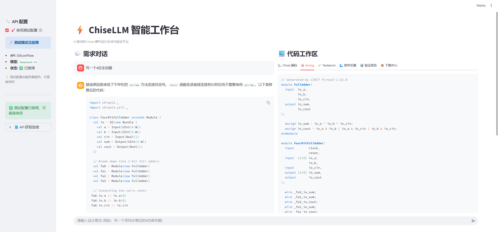

# ⚡ ChiseLLM

<p align="center">
  <b>AI 驱动的 Chisel 硬件设计生成与验证平台</b>
</p>

<p align="center">
  
  
  
  
  
</p>

---

## 🎯 项目简介

**ChiseLLM** 是一个利用大语言模型 (LLM) 进行硬件代码自动生成与自我修复的系统。项目实现了从自然语言需求到可仿真硬件设计的完整闭环。

### ✨ 核心特性

- 🔄 **自动代码生成** - 根据自然语言描述生成 Chisel 硬件代码
- 🔍 **反射验证闭环** - 编译→阐述→仿真三阶段自动验证
- 🛠️ **自愈式修复** - 验证失败自动反馈给 LLM 进行修复
- 🧪 **自动 Testbench** - 自动生成 C++ Verilator Testbench
- 🌊 **波形可视化** - VCD 波形实时渲染（WaveDrom）
- 🌐 **Web 工作台** - Streamlit 驱动的在线 IDE

### 🖥️ 项目展示

<p align="center">
  
  <br>
  <em>ChiseLLM 智能工作台 - AI 驱动的 Chisel 硬件设计平台</em>
</p>

---

## 🏗️ 项目架构

```
┌─────────────────────────────────────────────────────────────┐
│                  ChiseLLM 智能工作台 (Web)                   │
├─────────────────────────────────────────────────────────────┤
│  用户需求 → LLM 生成 → 反射验证 → 自动修复 → 仿真 → 波形     │
└─────────────────────────────────────────────────────────────┘
                              │
         ┌────────────────────┼────────────────────┐
         ▼                    ▼                    ▼
┌─────────────────┐  ┌─────────────────┐  ┌─────────────────┐
│   LLM Provider  │  │   Reflect Env   │  │   VCD Parser    │
│  ─────────────  │  │  ─────────────  │  │  ─────────────  │
│  • Gemini       │  │  • Mill 编译    │  │  • 波形解析     │
│  • OpenAI       │  │  • Verilator    │  │  • WaveDrom     │
│  • DeepSeek     │  │  • VCD 生成     │  │  • HTML 渲染    │
│  • Claude       │  └─────────────────┘  └─────────────────┘
│  • SiliconFlow  │
└─────────────────┘
```

---

## 📊 项目进展

| 阶段 | 目标 | 状态 |
|------|------|------|
| **Stage 1** | 反射环境 (Reflect Env) 构建 | ✅ 已完成 |
| **Stage 2** | SFT 数据集生成 (10,550 条) | ✅ 已完成 |
| **Stage 3** | Web 智能工作台部署 | ✅ 已完成 |

### 📁 数据资产

| 数据集 | 样本数 | 说明 |
|--------|--------|------|
| `chisel_sft_merged_10550.jsonl` | 10,550 | 完整训练集 |
| `eval_set_v1.jsonl` | 37 | 评估测试集 |

---

## 🚀 快速开始

### 在线体验

暂不支持在线体验，推荐本地运行

### 本地运行

```bash
# 1. 克隆仓库
git clone https://github.com/silence-breaker/ChiseLLM.git
cd ChiseLLM

# 2. 创建环境
conda create -n chisel-llm python=3.10
conda activate chisel-llm
pip install -r requirements.txt

# 3. 配置 API (可选)
mkdir -p .streamlit
cat > .streamlit/secrets.toml << 'EOF'
[default]
api_key = "your-api-key"
base_url = "https://api.siliconflow.cn/v1"
model_name = "deepseek-ai/DeepSeek-V3"
EOF

# 4. 启动应用
streamlit run app.py
```

---

## 📂 项目结构

```
ChiseLLM/
├── app.py                    # Streamlit Web 应用入口
├── build.sc                  # Mill 构建配置
├── requirements.txt          # Python 依赖
│
├── src/                      # 核心源码
│   ├── agent.py              # 智能代理 (生成-验证-修复循环)
│   ├── llm_provider.py       # 多 LLM Provider 统一接口
│   ├── reflect_env.py        # 反射验证环境
│   ├── vcd_parser.py         # VCD 波形解析器
│   └── run_reflect.py        # 命令行验证工具
│
├── data_gen/                 # 数据生成工具
│   ├── generator_V2.py       # 批量数据生成器
│   └── merge_and_prepare.py  # 数据合并脚本
│
├── eval/                     # 评估框架
│   ├── generate_eval_set.py  # 测试集生成
│   └── run_eval.py           # 模型评估脚本
│
├── dataset/                  # 数据集
│   └── chisel_sft_merged_10550.jsonl
│
├── training/                 # 训练配置
│   └── chisel_lora_config.yaml
│
└── docs/                     # 文档
    ├── 第一阶段成果总结.md
    ├── 第二阶段成果总结.md
    └── 第三阶段成果总结.md
```

---

## 🔧 核心功能

### 1️⃣ 反射验证环境

三阶段解耦验证流程：

```python
from src.reflect_env import reflect

result = reflect(
    chisel_code_string=code,
    module_name="MyModule",
    testbench_path="tb.cpp"  # 可选
)

# 返回: compiled, elaborated, sim_passed, generated_verilog, vcd_content
```

### 2️⃣ 多 LLM Provider

支持 7 种 API Provider：

| Provider | 协议 | 示例模型 |
|----------|------|----------|
| Google Gemini | SDK | gemini-2.0-flash-exp |
| OpenAI | SDK | gpt-4o |
| DeepSeek | OpenAI 兼容 | deepseek-chat |
| Qwen | OpenAI 兼容 | qwen-plus |
| Claude | SDK | claude-3-5-sonnet |
| SiliconFlow | OpenAI 兼容 | DeepSeek-V3 |
| Custom | OpenAI 兼容 | 自定义 |

### 3️⃣ 智能代理工作流

```
用户需求 ──→ LLM 生成 Chisel
              │
              ▼
         反射验证 (编译+阐述)
              │
        ┌─────┴─────┐
        ▼           ▼
      成功        失败 ──→ LLM 修复 ──→ 重试 (max 3)
        │
        ▼
   生成 Testbench
        │
        ▼
   Verilator 仿真
        │
        ▼
   波形渲染 + 下载
```

---

## 📖 文档

详细文档请查看 [`docs/`](docs/) 目录：

- [第一阶段成果总结](docs/第一阶段成果总结.md) - 反射环境构建
- [第二阶段成果总结](docs/第二阶段成果总结.md) - SFT 数据集生成
- [第三阶段成果总结](docs/第三阶段成果总结.md) - Web 智能工作台

---

## 🛠️ 技术栈

| 组件 | 技术 |
|------|------|
| 硬件描述语言 | Chisel 6.0.0 / Scala 2.13.12 |
| 构建工具 | Mill |
| 仿真器 | Verilator |
| Web 框架 | Streamlit |
| 波形渲染 | WaveDrom |
| LLM 微调 | LLaMA-Factory |

---

## 📜 许可证

本项目采用 [MIT License](LICENSE) 开源。

---

## 🤝 贡献

欢迎提交 Issue 和 Pull Request！

---

<p align="center">
  <sub>Made with ❤️ for Hardware AI</sub>
</p>
